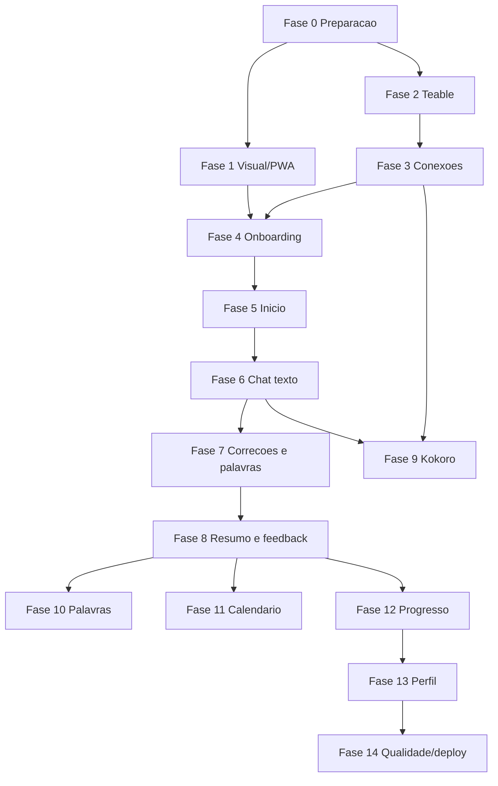

# AI Fluency - plano de construcao por fases

Este plano transforma a especificacao de produto em um roteiro de construcao do app. O app sera um PWA mobile-first para aprendizado de linguas com IA, usando Teable como banco de dados na VPS e Kokoro como motor de voz na VPS.

Documento base:

- [AI_FLUENCY_PRODUCT_LOGIC.md](AI_FLUENCY_PRODUCT_LOGIC.md)

Referencias visuais obrigatorias:

- [01. Onboarding / idioma](assets/screens/01-onboarding-idioma.png)
- [02. Inicio / tema](assets/screens/02-inicio-tema.png)
- [03. Chat / conversa](assets/screens/03-chat-conversa.png)
- [04. Palavras / vocabulario](assets/screens/04-palavras-vocabulario.png)
- [05. Calendario / feedback](assets/screens/05-calendario-feedback.png)
- [06. Progresso](assets/screens/06-progresso.png)
- [07. Perfil / preferencias](assets/screens/07-perfil-preferencias.png)
- [08. Resumo pos-conversa](assets/screens/08-resumo-pos-conversa.png)

## Regra visual absoluta

O design deve seguir as imagens anexadas com fidelidade: layout, espacamento, escala de tipografia, cards, botoes, chips, icones, uso de verde, fundo branco, divisores leves e energia visual tipo Duolingo.

A unica correcao permitida sobre as referencias e o bottom navigation:

1. Inicio
2. Chat
3. Palavras
4. Calendario
5. Perfil

Mesmo quando uma imagem mostrar `Conversa`, `Progresso` ou outro menu diferente, a implementacao deve usar o menu padrao acima. A tela Progresso existe, mas nao entra como item fixo no bottom nav. Ela e acessada por Inicio, Calendario ou Perfil.

## Estrategia geral

Construir em fases curtas, cada uma entregando uma camada testavel:

1. Fundacao visual e PWA.
2. Teable e modelo de dados.
3. Configuracoes de conexoes.
4. Onboarding e perfil de idioma.
5. Inicio e sugestoes de tema.
6. Chat com IA por texto.
7. Correcoes, palavras e feedback.
8. Kokoro e audio.
9. Calendario, palavras e progresso.
10. Polimento, seguranca, testes e deploy.

O principio de construcao e simples: primeiro o app precisa parecer certo, depois precisa salvar certo, depois precisa conversar certo, depois precisa ensinar melhor.

## Stack proposta

### Frontend

- PWA mobile-first.
- React/Next.js ou stack equivalente com rotas server-side/API routes.
- CSS com tokens proprios baseados no design.
- Componentes reutilizaveis: AppShell, BottomNav, Header, MetricBlock, TopicCard, SuggestionRow, AudioPlayer, CorrectionBlock, WordRow, CalendarGrid.

### Backend interno do app

- Rotas internas para proteger API keys.
- Servicos:
  - TeableService
  - AIService
  - KokoroService
  - LearningAnalysisService
  - RecommendationService

### Banco

- Teable na VPS.
- A chave do Teable fica no servidor, nunca no client.
- As tabelas devem ser criadas antes da logica de conversa real.

### Voz

- Kokoro na VPS.
- Kokoro gera TTS para mensagens da IA, explicacoes e pronuncia de palavras.
- Se Kokoro falhar, o app continua por texto.

### IA

- Provider configuravel.
- Modelo de conversa configuravel.
- A API key do provider fica no servidor.
- A IA deve retornar respostas estruturadas quando o app precisar salvar correcoes, palavras e feedback.

## Fase 0 - Preparacao e contratos

Objetivo: deixar o projeto pronto para ser construido sem ambiguidades.

Entregas:

- Escolher stack final.
- Criar repositorio/app base.
- Definir variaveis de ambiente.
- Definir base URL do Teable.
- Definir base URL do Kokoro.
- Confirmar provider de IA inicial.
- Confirmar se o app tera autenticacao real no MVP ou usuario local unico.

Arquivos esperados:

- `.env.example`
- README de setup local.
- Documento de tokens visuais.
- Documento de mapeamento Teable.

Variaveis previstas:

```text
APP_URL=
TEABLE_BASE_URL=
TEABLE_API_KEY=
TEABLE_BASE_ID=
KOKORO_BASE_URL=
KOKORO_API_KEY=
AI_PROVIDER=
AI_BASE_URL=
AI_API_KEY=
AI_CHAT_MODEL=
ENCRYPTION_SECRET=
```

Criterios de aceite:

- O app inicia localmente.
- Existe `.env.example` sem segredos reais.
- As imagens de referencia estao no repositorio.
- A equipe sabe qual stack sera usada.

## Fase 1 - Fundacao visual mobile-first PWA

Objetivo: implementar a base visual fiel as telas antes de integrar dados reais.

Telas envolvidas:

- Onboarding
- Inicio
- Chat
- Palavras
- Calendario
- Perfil
- Resumo pos-conversa
- Progresso interno

Entregas:

- AppShell mobile-first.
- BottomNav padrao.
- Tokens de design.
- Componentes base.
- Manifest PWA.
- Icones do PWA.
- Theme color.
- Splash/loading state.
- Layout responsivo para mobile primeiro.

Tokens visuais:

- Fundo principal: branco.
- Cor primaria: verde.
- Texto principal: preto.
- Texto secundario: cinza.
- Cards: branco, borda cinza clara, raio alto.
- Icones: linhas pretas em circulos pastel.
- CTA principal: botao preto ou verde conforme referencia.
- Divisores: linhas finas claras.

Componentes:

- `BottomNav`
- `ScreenHeader`
- `LanguageSelector`
- `LevelSelector`
- `TopicInputCard`
- `SuggestionRow`
- `FeedbackMetric`
- `WordMetric`
- `ChatBubble`
- `AudioPlayer`
- `CorrectionBlock`
- `SavedWordsBar`
- `CalendarGrid`
- `SettingsRow`

Regras de implementacao visual:

- Seguir as telas anexadas, nao redesenhar do zero.
- Bottom nav sempre igual.
- Areas clicaveis grandes para toque.
- Nada de layout desktop como prioridade.
- Progresso nao aparece no menu fixo.
- Evitar excesso de cards aninhados.

Criterios de aceite:

- Todas as telas estaticas renderizam em viewport mobile.
- O bottom nav esta correto em todas as telas principais.
- O visual bate com as referencias em hierarquia, espacamento, cores e estilo.
- O app e instalavel como PWA em ambiente local ou staging.

## Fase 2 - Teable: schema, acesso e persistencia base

Objetivo: montar a camada de banco e salvar dados reais no Teable.

Tabelas Teable:

1. Users
2. LanguageProfiles
3. AIProviderSettings
4. VoiceProviderSettings
5. Conversations
6. Messages
7. Corrections
8. Words
9. WordOccurrences
10. DailyFeedbacks
11. Topics
12. PracticeSessions
13. AppEvents

Entregas:

- Criar tabelas no Teable.
- Mapear campos e tipos.
- Criar TeableService.
- Criar rotas internas para CRUD seguro.
- Criar healthcheck de Teable.
- Criar seed inicial opcional para modo demo.

Rotas internas sugeridas:

```text
GET  /api/health/teable
GET  /api/profile
POST /api/profile
GET  /api/language-profiles
POST /api/language-profiles
GET  /api/topics
POST /api/topics
POST /api/events
```

Regras:

- O frontend nunca chama Teable direto.
- Toda escrita relevante registra `AppEvent`.
- Falha no Teable bloqueia conversa real.
- Se uma conversa terminar e falhar salvamento final, manter estado pendente local.

Criterios de aceite:

- Healthcheck do Teable funciona.
- Um usuario/perfil de idioma pode ser salvo.
- Um topico pode ser criado.
- Eventos basicos sao registrados.
- Nenhuma chave do Teable aparece no client bundle.

## Fase 3 - Configuracoes de conexoes

Objetivo: construir a tela onde o usuario configura IA, Teable e Kokoro.

Tela:

- Perfil > Conexoes e IA.

Blocos:

- IA de conversa.
- Teable.
- Kokoro voz.

Campos IA:

- Provider.
- Base URL se custom.
- API key.
- Modelo de conversa.
- Temperatura/criatividade.
- Botao `Testar IA`.

Campos Teable:

- Teable Base URL.
- Teable API key.
- Base ID.
- Botao `Testar Teable`.

Campos Kokoro:

- Kokoro Base URL.
- Kokoro API key.
- Voz padrao.
- Velocidade.
- Formato de audio.
- Botao `Testar voz`.

Entregas:

- UI de configuracoes seguindo Perfil.
- Mascaramento de chaves salvas.
- Rotas de teste de conexao.
- Estados: vazio, testando, conectado, erro.
- Persistencia segura ou via variaveis de ambiente no servidor.

Rotas:

```text
GET  /api/settings/connections
POST /api/settings/ai
POST /api/settings/teable
POST /api/settings/kokoro
POST /api/settings/test-ai
POST /api/settings/test-teable
POST /api/settings/test-kokoro
```

Criterios de aceite:

- Usuario consegue ver status de IA, Teable e Kokoro.
- Teste de IA retorna sucesso ou erro claro.
- Teste de Teable valida acesso.
- Teste de Kokoro gera uma frase curta.
- Sem IA ou Teable configurados, o app bloqueia conversa real.
- Sem Kokoro, o app permite texto e desativa audio.

## Fase 4 - Onboarding e perfil de idioma

Objetivo: criar o primeiro perfil de aprendizado.

Tela:

- 01. Onboarding / idioma.

Fluxo:

1. Usuario escolhe idioma.
2. Usuario escolhe nivel.
3. Usuario escolhe objetivo.
4. Usuario escolhe estilo de correcao inicial.
5. App cria `LanguageProfile`.
6. App checa conexoes obrigatorias.
7. Se conexoes OK, vai para Inicio.
8. Se faltam conexoes, vai para Conexoes e IA.

Dados salvos:

- language_code
- language_name
- level
- learning_goal
- correction_style
- audio_enabled
- transcript_enabled
- weekly_conversation_goal
- weekly_word_goal

Criterios de aceite:

- Onboarding cria perfil real no Teable.
- Ao voltar ao app, perfil ativo e carregado.
- O usuario nao cai em tela sem acao clara.
- Sem IA/Teable, encaminha para configuracao.

## Fase 5 - Inicio e escolha de tema

Objetivo: construir a home como centro de decisao da pratica.

Tela:

- 02. Inicio / tema.

Elementos:

- Saudacao.
- Streak.
- Sino.
- Seletor de idioma.
- Seletor de nivel.
- Campo de tema.
- Botao `Sugerir um tema para mim`.
- Sugestoes baseadas no calendario.
- Feedback recente.
- Suas palavras.
- CTA `Iniciar conversa livre`.
- Botao de teclado.
- Bottom nav padrao.

Funcionamento:

- Tema digitado cria `Topic` source `user_custom`.
- Sugestao da IA cria `Topic` source `ai_suggestion` ou `calendar_based`.
- `Comecar` cria `Conversation`.
- `Ver calendario` abre Calendario.
- `Ver tudo` em feedback abre Progresso ou historico.
- `Ver todas` em palavras abre Palavras.
- `Iniciar conversa livre` cria Conversation mode `free_conversation`.

Rotas:

```text
GET  /api/home
POST /api/topics/suggest
POST /api/conversations/start
```

Contexto enviado para sugestao de tema:

- Idioma.
- Nivel.
- Objetivo.
- Feedbacks recentes.
- Erros recorrentes.
- Palavras para revisar.
- Temas praticados recentemente.

Criterios de aceite:

- Home renderiza com dados reais do Teable.
- Sugestoes explicam o motivo pedagogico.
- Cada botao leva a uma acao concreta.
- CTA de conversa livre inicia conversa.

## Fase 6 - Chat com IA por texto

Objetivo: implementar o nucleo conversacional antes de voz.

Tela:

- 03. Chat / conversa.

Elementos:

- Top bar.
- Card de topico.
- Botao `Mudar`.
- Mensagem da IA.
- Mensagem do usuario.
- Composer.
- Acoes rapidas.
- Bottom nav padrao com Chat ativo.

Fluxo:

1. App cria Conversation.
2. Backend monta prompt do tutor.
3. IA envia primeira pergunta.
4. Usuario responde.
5. Mensagem e salva.
6. IA responde.
7. Conversa segue ate usuario finalizar ou sair.

Rotas:

```text
POST /api/conversations/start
GET  /api/conversations/:id
POST /api/conversations/:id/messages
POST /api/conversations/:id/change-topic
POST /api/conversations/:id/end
```

Prompt do tutor:

- Idioma alvo.
- Nivel.
- Tema.
- Objetivo.
- Estilo de correcao.
- Palavras a revisar.
- Erros recorrentes.
- Historico curto da conversa.

Criterios de aceite:

- Conversa por texto funciona.
- Mensagens sao salvas no Teable.
- Chat respeita tema e nivel.
- `Mudar` nao perde estado sem confirmacao.
- Erros de IA mostram recuperacao clara.

## Fase 7 - Correcoes, palavras e analise de aprendizado

Objetivo: transformar o chat em aprendizado estruturado.

Telas:

- 03. Chat / conversa.
- 08. Resumo pos-conversa.
- 04. Palavras / vocabulario.

Entregas:

- Analise estruturada da mensagem do usuario.
- Criacao de `Correction`.
- Extracao de palavras.
- Criacao/atualizacao de `Word`.
- Criacao de `WordOccurrence`.
- Exibicao inline de correcao.
- Barra `3 novas palavras salvas`.

Resposta estruturada esperada da IA:

```json
{
  "assistant_reply": "text",
  "corrections": [
    {
      "original": "I have coffee",
      "corrected": "I had coffee",
      "error_type": "tense",
      "explanation": "Use past simple for something that already happened.",
      "severity": "medium"
    }
  ],
  "words": [
    {
      "display_text": "breakfast",
      "lemma": "breakfast",
      "translation": "cafe da manha",
      "context": "What did you have for breakfast?"
    }
  ],
  "fluency_notes": {
    "strength": "Clear answer",
    "focus": "Past simple"
  }
}
```

Regras:

- Nem todo erro precisa interromper.
- Erro recorrente deve ser destacado.
- Cada correcao precisa explicar o por que.
- Palavras devem ser agrupadas por lemma.
- Palavra ja existente atualiza total e ultima vez usada.

Criterios de aceite:

- Correcoes aparecem no chat no estilo da referencia.
- Palavra salva aparece em Palavras.
- Detalhe da palavra mostra contexto real.
- Erros recorrentes ficam disponiveis para feedback.

## Fase 8 - Resumo pos-conversa e feedback diario

Objetivo: fechar cada conversa com aprendizagem consolidada.

Tela:

- 08. Resumo pos-conversa.

Fluxo:

1. Usuario encerra conversa.
2. Backend coleta mensagens, correcoes e palavras.
3. IA gera resumo pedagogico.
4. App salva `DailyFeedback`.
5. App atualiza streak e metas.
6. App sugere proximo tema.

Dados gerados:

- correction_score
- fluency_score
- new_words_count
- strengths
- weaknesses
- recommended_focus
- recurring_errors
- suggested_topics

Rotas:

```text
POST /api/conversations/:id/end
GET  /api/conversations/:id/summary
POST /api/daily-feedback
```

Criterios de aceite:

- Resumo salva feedback no Teable.
- Calendario passa a mostrar o dia praticado.
- Sugestao futura usa esse feedback.
- Usuario pode ir para Calendario, Palavras ou proximo tema.

## Fase 9 - Kokoro e recursos de voz

Objetivo: adicionar voz sem quebrar a experiencia por texto.

Telas:

- Chat.
- Correcoes.
- Palavras.
- Perfil/conexoes.

Funcionalidades:

- Gerar audio de mensagem da IA.
- Gerar audio de explicacao.
- Gerar pronuncia de palavra.
- Player de audio no chat.
- Estado de audio carregando.
- Estado de falha com fallback para texto.

Rotas:

```text
POST /api/voice/synthesize
GET  /api/voice/:audioId
POST /api/settings/test-kokoro
```

Fluxo:

1. IA gera texto.
2. Texto aparece imediatamente.
3. Backend envia texto ao Kokoro.
4. Audio aparece quando pronto.
5. Se falhar, texto permanece.

Criterios de aceite:

- Chat nao fica bloqueado esperando audio.
- Kokoro testado em configuracoes.
- Audio de explicacao funciona.
- Pronuncia de palavra funciona.
- Sem Kokoro, UI continua coerente por texto.

Observacao sobre fala do usuario:

- Se houver STT no MVP, definir provider especifico.
- Se nao houver STT no MVP, microfone pode gravar apenas em fase posterior.
- O MVP pode comecar com texto + TTS da IA via Kokoro.

## Fase 10 - Palavras e revisao

Objetivo: transformar vocabulario capturado em pratica.

Tela:

- 04. Palavras / vocabulario.

Elementos:

- Total de palavras.
- Palavras novas na semana.
- Palavras para revisar.
- Filtros.
- Lista.
- CTA `Praticar palavras fracas`.

Rotas:

```text
GET  /api/words
GET  /api/words/:id
POST /api/words/:id/practice
POST /api/practice/weak-words
```

Funcionamento:

- Filtro `Todas`: lista geral.
- Filtro `Recentes`: usadas recentemente.
- Filtro `Revisar`: review_due_at vencido.
- Filtro `Corrigidas`: ligadas a erro.
- `Praticar palavras fracas`: cria Topic e Conversation com essas palavras.

Criterios de aceite:

- Lista vem do Teable.
- Filtros funcionam.
- Palavra tem detalhe com exemplos reais.
- Revisao cria conversa com objetivo claro.

## Fase 11 - Calendario e recomendacoes

Objetivo: transformar feedback diario em memoria de aprendizado.

Tela:

- 05. Calendario / feedback.

Elementos:

- Mes.
- Dias praticados.
- Feedback de hoje.
- Sugestoes da IA.
- Historico recente.
- Bottom nav padrao com Calendario ativo.

Rotas:

```text
GET  /api/calendar?month=YYYY-MM
GET  /api/daily-feedback/:date
POST /api/daily-feedback/:date/practice
```

Funcionamento:

- Dia com feedback aparece marcado.
- Tocar em dia abre detalhe.
- `Praticar` cria conversa source `calendar_focus`.
- Sugestoes usam feedback e erros recorrentes.

Criterios de aceite:

- Feedback aparece no dia correto.
- Sugestao tem motivo.
- Botao praticar inicia conversa contextual.
- Calendario nao e apenas historico; ele recomenda.

## Fase 12 - Progresso interno

Objetivo: mostrar panorama sem virar aba principal.

Tela:

- 06. Progresso.

Acesso:

- Inicio > Seu feedback recente > Ver tudo.
- Calendario > Historico recente.
- Perfil > Progresso.

Bottom nav:

- Sempre padrao.
- Nenhum item `Progresso`.
- Se estiver em Progresso, pode manter item relacionado anterior ativo ou nenhum ativo, mas nao alterar o menu.

Metricas:

- Nivel atual.
- Fluidez mensal.
- Correcoes aplicadas.
- Erros recorrentes.
- Palavras novas.
- Pontos fortes.
- Foco da semana.
- Sequencia.

Rotas:

```text
GET /api/progress
POST /api/progress/focus-practice
```

Criterios de aceite:

- Progresso agrega dados reais.
- `Treinar foco da semana` cria conversa.
- Tela nao compete com Calendario.

## Fase 13 - Perfil, preferencias e privacidade

Objetivo: consolidar controle do usuario.

Tela:

- 07. Perfil / preferencias.

Elementos:

- Nome/avatar.
- Idioma ativo.
- Nivel.
- Streak.
- Estilo de correcao.
- Audio/transcricao.
- Memoria do calendario.
- Conexoes e IA.
- Exportar dados.
- Limpar historico.

Rotas:

```text
GET  /api/profile
PATCH /api/profile
PATCH /api/preferences
GET  /api/export
POST /api/data/delete-confirmation
DELETE /api/data
```

Criterios de aceite:

- Preferencias mudam comportamento do chat.
- Usuario ve status das conexoes.
- Exportacao baixa dados.
- Exclusao exige confirmacao forte.

## Fase 14 - Qualidade, seguranca e deploy

Objetivo: preparar o app para uso real.

Checklist tecnico:

- API keys nao aparecem no client bundle.
- Teable chamado apenas pelo backend.
- Kokoro chamado apenas pelo backend.
- Erros de IA/Teable/Kokoro tratados.
- Loading states em todas as rotas lentas.
- PWA instalavel.
- Layout verificado em mobile.
- Bottom nav padrao em todas as telas.
- Progresso sem item proprio no bottom nav.
- Sem dados mockados em fluxo real.

Testes funcionais:

- Onboarding completo.
- Configurar Teable.
- Configurar IA.
- Configurar Kokoro.
- Iniciar conversa livre.
- Iniciar conversa por tema sugerido.
- Receber correcao.
- Salvar palavras.
- Finalizar conversa.
- Ver feedback no calendario.
- Praticar palavra fraca.
- Gerar audio da IA.
- Falha de Kokoro nao quebra chat.
- Falha de Teable bloqueia uso real.

Testes visuais:

- Comparar cada tela com referencia anexada.
- Validar bottom nav padrao.
- Validar toque em viewport mobile.
- Validar textos sem corte.
- Validar safe area em mobile.

Criterios de aceite:

- Fluxo de aprendizado completo funciona ponta a ponta.
- Dados aparecem corretamente no Teable.
- Audio via Kokoro funciona ou degrada com elegancia.
- App instala como PWA.
- Design esta fiel as referencias.

## Ordem recomendada de implementacao das telas

1. AppShell + BottomNav.
2. Perfil/conexoes.
3. Onboarding.
4. Inicio.
5. Chat por texto.
6. Resumo pos-conversa.
7. Palavras.
8. Calendario.
9. Progresso.
10. Voz Kokoro na conversa.
11. Detalhes e estados vazios.

Motivo: configuracoes e dados precisam existir antes do chat real; o chat precisa existir antes de palavras, calendario e progresso serem uteis.

## Dependencias entre fases



## Backlog por prioridade

### P0 - indispensavel para MVP

- PWA base.
- Bottom nav padrao.
- Teable conectado.
- Configuracao de IA.
- Onboarding.
- Home com tema.
- Chat por texto.
- Correcoes estruturadas.
- Palavras salvas.
- Resumo pos-conversa.
- Feedback no calendario.
- Perfil com preferencias.

### P1 - forte valor de aprendizado

- Kokoro TTS.
- Audio de explicacao.
- Pronuncia de palavras.
- Praticar palavras fracas.
- Sugestoes baseadas no calendario.
- Progresso interno.

### P2 - evolucao posterior

- STT para fala do usuario.
- Offline queue robusta.
- Multiplos idiomas simultaneos.
- Revisao espacada avancada.
- Exportacao sofisticada.
- Personas de tutor.
- Gamificacao avancada.

## Riscos e decisoes pendentes

1. STT do usuario
   - Kokoro cobre TTS, nao necessariamente transcricao.
   - Decidir depois se MVP tera entrada por voz real ou apenas texto + TTS.

2. Autenticacao
   - Definir se o MVP sera usuario unico pessoal ou multiusuario.
   - Usuario unico simplifica muito.

3. Criacao das tabelas Teable
   - Pode ser manual na VPS ou automatizada por script.
   - Para MVP, manual com checklist e mais seguro.

4. Armazenamento de audio
   - Decidir se audio do Kokoro fica em cache local, arquivo na VPS, storage externo ou apenas temporario.

5. Criptografia de API keys
   - Se as chaves forem apenas env vars do servidor, a tela pode mostrar status sem persistir key por usuario.
   - Se forem configuradas pela UI, precisa criptografia real com `ENCRYPTION_SECRET`.

## Definicao de pronto do MVP

O MVP esta pronto quando:

- O usuario instala ou abre o PWA no celular.
- Configura Teable, IA e opcionalmente Kokoro.
- Escolhe idioma e nivel.
- Recebe sugestoes de tema.
- Inicia conversa.
- Recebe resposta da IA.
- Recebe correcao explicada.
- Palavras usadas sao salvas.
- Ao finalizar, recebe resumo.
- Feedback aparece no calendario.
- Palavras aparecem na tela Palavras.
- Perfil controla preferencias.
- Design segue as 8 referencias com bottom nav corrigido.
