# AI Fluency - logica de produto e funcionamento

Este documento define a estrutura funcional do app de aprendizado de linguas com IA, usando a direcao visual da primeira referencia: branco, verde, icones grandes, cards leves, metricas claras e bottom navigation fixa.

## Referencias visuais anexadas

As imagens abaixo sao a referencia atual de produto. Elas devem guiar a construcao visual do PWA mobile-first.

| Tela | Mockup |
| --- | --- |
| 01. Onboarding / idioma | 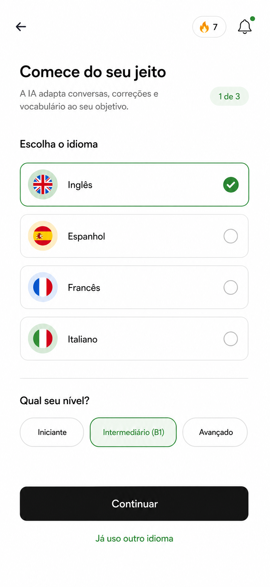 |
| 02. Inicio / tema | 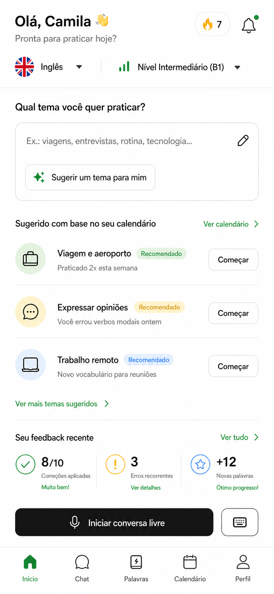 |
| 03. Chat / conversa | 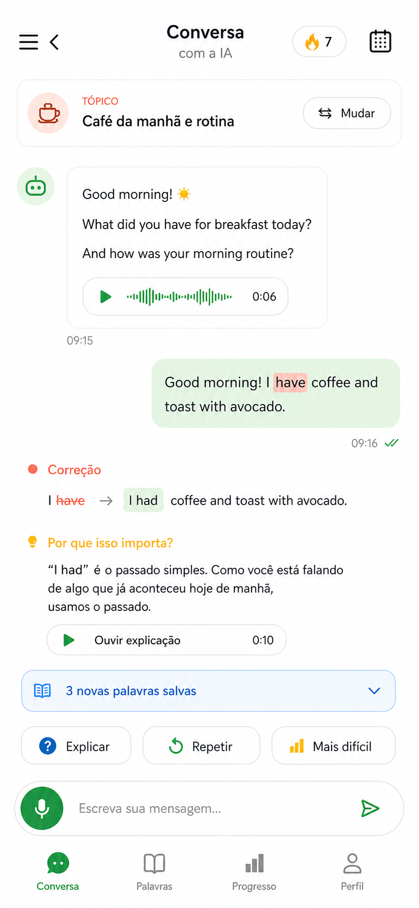 |
| 04. Palavras / vocabulario | 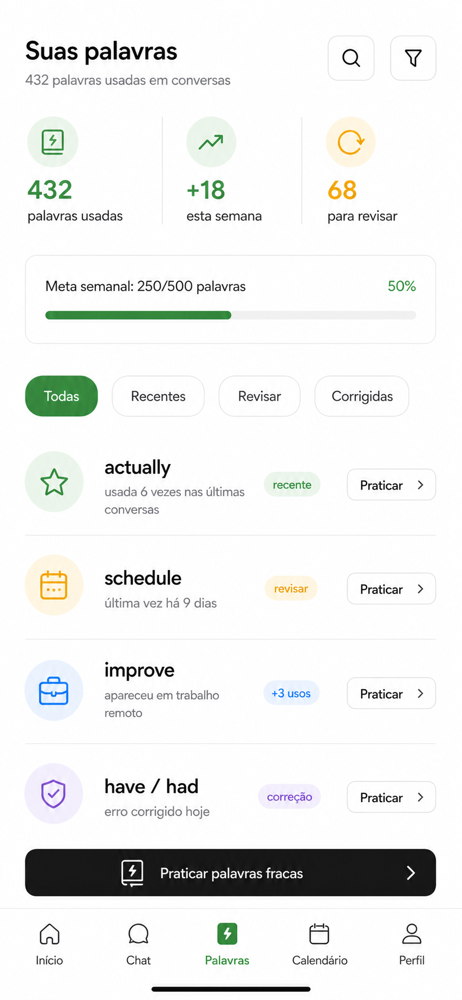 |
| 05. Calendario / feedback | 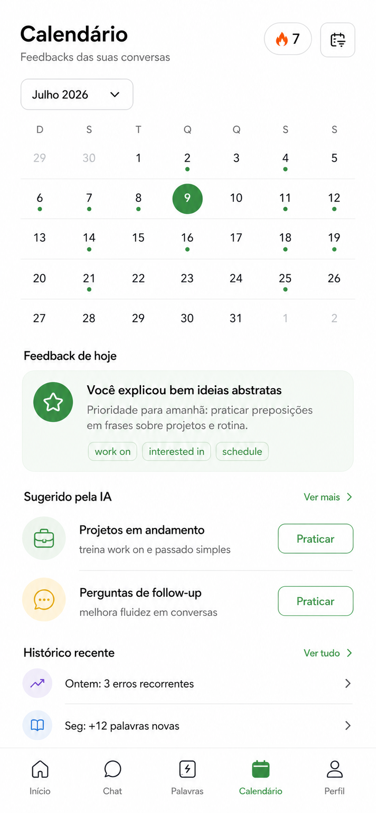 |
| 06. Progresso | 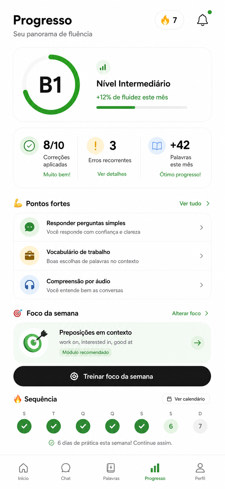 |
| 07. Perfil / preferencias | 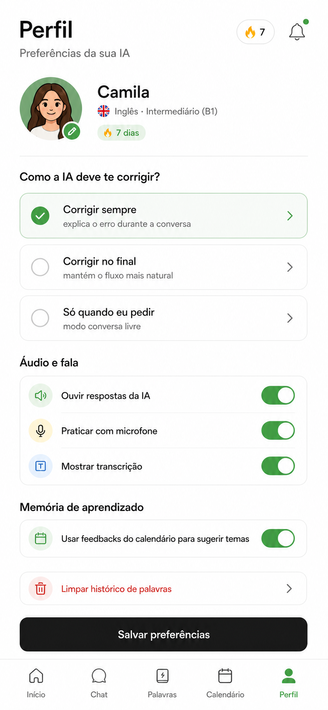 |
| 08. Resumo pos-conversa | 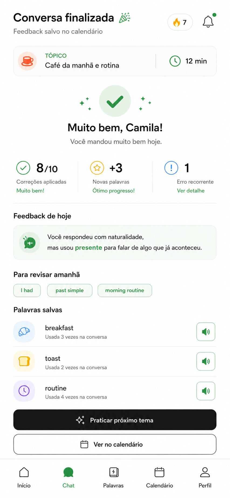 |

## Correcao visual obrigatoria

O bottom navigation padrao do app deve ser o mesmo em todas as telas principais:

1. Inicio
2. Chat
3. Palavras
4. Calendario
5. Perfil

A tela Conversa gerada com `Conversa, Palavras, Progresso, Perfil` esta errada. A tela Progresso tambem esta errada se aparecer como item fixo no bottom nav. Progresso deve existir como tela interna acessada por cards de Inicio, Perfil ou Calendario, mas nao deve substituir Calendario na navegacao principal.

## Decisoes tecnicas confirmadas

O app sera construido como web app mobile-first PWA.

Stack funcional prevista:

- Frontend: PWA mobile-first, responsivo, instalavel no celular.
- Banco de dados: Teable rodando na VPS do usuario.
- Voz: Kokoro rodando na VPS do usuario.
- IA de conversa: provider configuravel pelo usuario com API key e modelo.
- Credenciais: Teable API key, Kokoro API key/base URL e provider de IA serao informados apenas na fase de construcao/configuracao.

Implicacoes:

- O app deve funcionar muito bem em viewport mobile antes de desktop.
- A estrutura visual deve respeitar safe areas, bottom nav fixa e controles grandes para toque.
- O PWA deve ter manifest, icones, tema, installability e fallback offline basico.
- O Teable sera tratado como fonte persistente principal.
- O Kokoro sera usado para gerar voz da IA e, se a infraestrutura permitir, reproduzir explicacoes e frases de pratica.
- As API keys nao devem ser hardcoded no codigo nem salvas em texto puro.

## Proposta central

O app ensina linguas criando um ciclo de pratica conversacional:

1. O usuario escolhe idioma, nivel, objetivo e preferencias de correcao.
2. O usuario escolhe um tema ou pede sugestao da IA.
3. A IA conduz uma conversa em texto e audio.
4. A IA corrige erros no contexto e explica o motivo.
5. O app registra palavras usadas, erros, temas, tempo de pratica e evolucao.
6. Ao final, a IA cria um feedback diario salvo no calendario.
7. O feedback do calendario alimenta sugestoes futuras de temas e revisoes.

O produto nao e apenas um chat. O chat e o motor de coleta de evidencia; calendario, palavras e progresso transformam essa evidencia em aprendizagem continua.

## Arquitetura de navegacao

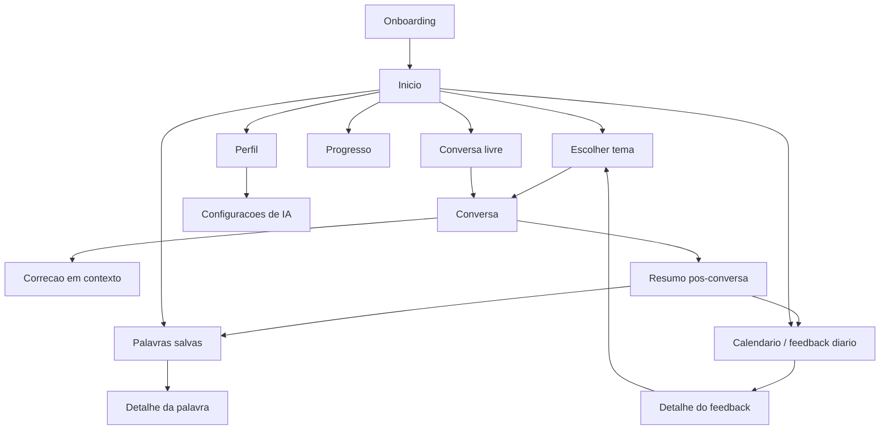

## Loop de aprendizado

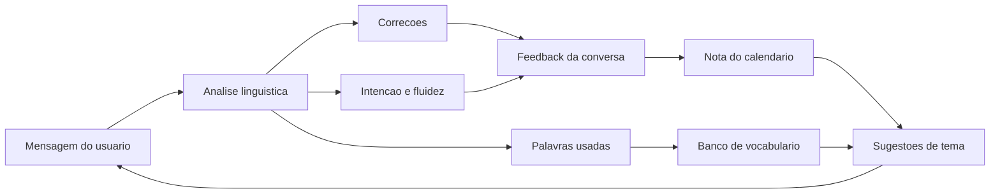

## Arquitetura tecnica do PWA

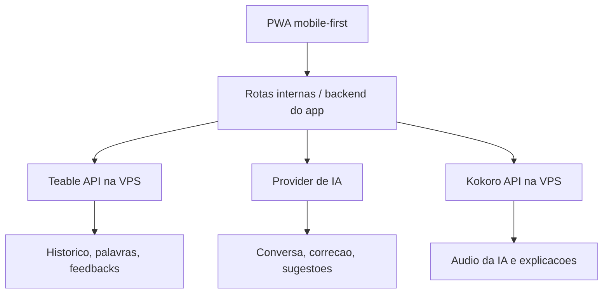

Responsabilidades:

- PWA: interface, estado local temporario, gravacao de audio, reproducao de audio e instalacao no celular.
- Backend do app: seguranca, validacao, chamadas ao Teable, chamadas ao provider de IA, chamadas ao Kokoro e orquestracao.
- Teable: persistencia de usuario, conversas, mensagens, palavras, correcoes, feedbacks e eventos.
- Provider de IA: geracao de conversa, analise linguistica, correcao, feedback e recomendacoes.
- Kokoro: text-to-speech para mensagens da IA, explicacoes, frases de pratica e pronuncia de palavras.

Principios:

- Mobile-first real: a tela principal de uso e o celular.
- PWA instalavel: manifest, icones, theme color, service worker e estado de carregamento.
- Offline basico: telas podem abrir e mostrar ultimo estado salvo em cache, mas novas conversas exigem conexao.
- Seguranca: chaves ficam no servidor; o frontend recebe apenas status de conexao.
- Latencia: chat deve responder em texto primeiro se o audio demorar.

## Modelo mental do app

O usuario deve sentir que esta conversando com um professor particular que lembra do historico. Cada tela tem uma funcao pedagogica:

- Inicio: decide o que praticar hoje.
- Chat: pratica real, com correcao no momento certo.
- Palavras: mostra o vocabulario real usado pelo usuario.
- Calendario: cria memoria diaria de aprendizado.
- Perfil: controla idioma, nivel, estilo de correcao e IA usada.

## Estrutura de dados no Teable

O Teable sera o banco principal. Cada entidade abaixo deve virar uma tabela no Teable, com relacionamentos por IDs entre tabelas. A implementacao deve usar a API do Teable por uma camada propria no backend do app, nunca diretamente do navegador com chave sensivel exposta.

Camada recomendada:

- Frontend PWA chama rotas internas do app.
- Rotas internas validam entrada, aplicam regras de produto e chamam Teable.
- Teable API key fica em variavel de ambiente no servidor.
- O frontend nunca recebe a Teable API key.

Tabelas principais:

- Users
- LanguageProfiles
- AIProviderSettings
- VoiceProviderSettings
- Conversations
- Messages
- Corrections
- Words
- WordOccurrences
- DailyFeedbacks
- Topics
- PracticeSessions
- AppEvents

## Entidades principais do banco

### User

Guarda identidade e preferencias globais.

Campos:

- id
- name
- avatar_url
- active_language_id
- created_at
- timezone

### LanguageProfile

Um perfil por idioma estudado.

Campos:

- id
- user_id
- language_code
- language_name
- level
- learning_goal
- correction_style
- audio_enabled
- transcript_enabled
- calendar_memory_enabled
- weekly_conversation_goal
- weekly_word_goal

### AIProviderSetting

Local onde o usuario configura API key e modelo de IA.

Campos:

- id
- user_id
- provider
- base_url
- api_key_encrypted
- chat_model
- reasoning_model
- temperature
- max_tokens
- is_active
- created_at
- updated_at

Regras:

- A API key nunca aparece inteira depois de salva.
- Mostrar apenas mascara, exemplo: `sk-...9Xq2`.
- A chave deve ser criptografada no armazenamento.
- O app deve ter botao `Testar conexao`.
- Se a chave falhar, o chat nao inicia e mostra erro claro.
- O usuario pode trocar modelo sem perder historico.

Providers possiveis:

- OpenAI
- Anthropic
- Google
- OpenRouter
- Custom OpenAI-compatible

### VoiceProviderSetting

Local onde o app configura a voz via Kokoro na VPS.

Campos:

- id
- user_id
- provider
- base_url
- api_key_encrypted
- default_voice
- speech_speed
- output_format
- is_active
- created_at
- updated_at

Regras:

- Provider inicial: `kokoro`.
- A Kokoro API key deve ficar criptografada ou em variavel de ambiente do servidor.
- O frontend nunca deve chamar Kokoro expondo chave sensivel.
- O app deve ter botao `Testar voz`.
- Se Kokoro falhar, a conversa por texto continua funcionando.
- Audio gerado pode ser cacheado por mensagem/frase para reduzir custo e latencia.

### Conversation

Representa uma sessao de estudo.

Campos:

- id
- user_id
- language_profile_id
- topic_id
- mode
- status
- started_at
- ended_at
- duration_seconds
- ai_model_used
- summary

Modes:

- free_conversation
- suggested_topic
- custom_topic
- review_words
- calendar_focus

### Message

Cada fala da conversa.

Campos:

- id
- conversation_id
- role
- text
- audio_url
- transcript_text
- created_at
- language_detected
- tokens_used

Roles:

- user
- assistant
- system

### Correction

Erros e melhorias detectados pela IA.

Campos:

- id
- conversation_id
- message_id
- original_text
- corrected_text
- error_type
- explanation
- severity
- should_interrupt
- created_at

Tipos de erro:

- grammar
- vocabulary
- pronunciation
- tense
- preposition
- word_order
- naturalness
- spelling

### Word

Palavra ou expressao consolidada no vocabulario do usuario.

Campos:

- id
- user_id
- language_profile_id
- lemma
- display_text
- translation
- part_of_speech
- familiarity_score
- total_uses
- last_used_at
- first_used_at
- review_due_at

### WordOccurrence

Cada vez que uma palavra aparece.

Campos:

- id
- word_id
- conversation_id
- message_id
- used_text
- sentence_context
- was_correct
- created_at

### DailyFeedback

Nota gerada ao final de uma ou mais conversas no mesmo dia.

Campos:

- id
- user_id
- language_profile_id
- date
- strengths
- weaknesses
- recommended_focus
- recurring_errors
- new_words_count
- correction_score
- fluency_score
- suggested_topics
- created_at

### Topic

Tema sugerido, criado pelo usuario ou gerado pela IA.

Campos:

- id
- user_id
- language_profile_id
- title
- source
- reason
- related_feedback_id
- related_words
- difficulty
- created_at

Sources:

- user_custom
- ai_suggestion
- calendar_based
- weak_words
- recurring_error

## Sistema de IA

### Prompt base do tutor

A IA deve atuar como tutor conversacional. Ela deve:

- Conversar no idioma alvo.
- Adaptar complexidade ao nivel do usuario.
- Manter o tema escolhido.
- Corrigir erros importantes.
- Explicar por que a correcao melhora a frase.
- Registrar palavras e expressoes relevantes.
- Sugerir revisoes com base no historico.
- Evitar transformar toda conversa em prova.

### Modos de correcao

1. Corrigir sempre
   - Mostra correcao imediatamente depois da mensagem do usuario.
   - Ideal para estudo ativo.

2. Corrigir no final
   - Mantem conversa natural.
   - Resume erros no final.

3. So quando eu pedir
   - Botoes `Explicar`, `Corrigir`, `Repetir`.
   - Ideal para fluencia.

### Politica de interrupcao

A IA so interrompe a conversa quando:

- O erro impede compreensao.
- O erro e recorrente.
- O erro esta ligado ao foco da semana.
- O usuario escolheu `Corrigir sempre`.

Erros pequenos de naturalidade podem ir para o resumo final.

### Extracao de palavras

A cada mensagem do usuario:

1. Normalizar texto.
2. Detectar idioma alvo.
3. Extrair palavras e expressoes uteis.
4. Agrupar variacoes no mesmo lemma.
5. Registrar ocorrencia com frase de contexto.
6. Atualizar `total_uses` e `last_used_at`.
7. Marcar palavras novas.
8. Marcar palavras para revisao se ficarem muito tempo sem uso.

### Geracao de feedback diario

Ao finalizar conversa:

1. Calcular total de mensagens, tempo e palavras novas.
2. Identificar erros recorrentes.
3. Identificar ponto forte.
4. Identificar foco recomendado.
5. Salvar nota no calendario.
6. Gerar sugestoes de tema para a proxima pratica.

## Sistema de voz com Kokoro

Kokoro sera usado para transformar texto em fala. Ele nao substitui o modelo de IA; ele recebe texto ja decidido pelo tutor e devolve audio.

Fluxo de audio da IA:

1. IA gera resposta textual.
2. App salva mensagem no Teable.
3. Backend envia texto ao Kokoro.
4. Kokoro retorna audio.
5. App salva `audio_url` ou blob/cache associado a mensagem.
6. Frontend mostra player de audio.

Fluxo de explicacao em audio:

1. Usuario toca `Ouvir explicacao`.
2. App pega a explicacao da correcao.
3. Backend envia texto ao Kokoro.
4. Audio aparece no player da correcao.

Fluxo de pronuncia de palavra:

1. Usuario abre detalhe da palavra.
2. Toca `Ouvir`.
3. Backend envia palavra/frase ao Kokoro.
4. App reproduz e pode cachear.

Fallback:

- Se Kokoro estiver indisponivel, o app continua por texto.
- Players mostram estado `Audio indisponivel agora`.
- O erro fica registrado em evento interno, mas nao interrompe aprendizado.

## Telas e funcionamento

### 1. Onboarding / escolha de idioma

Objetivo: criar o primeiro `LanguageProfile`.

Elementos:

- Lista de idiomas.
- Seletor de nivel.
- Objetivo de aprendizado.
- Preferencia inicial de correcao.
- Botao `Continuar`.

Funcionamento:

- Ao selecionar idioma, atualizar previsualizacao de nivel e exemplos.
- Ao tocar `Continuar`, criar perfil de idioma.
- Se o usuario ainda nao configurou IA, levar para `Configuracoes de IA`.
- Se ja configurou IA, levar para `Inicio`.

### 2. Configuracoes de IA e conexoes

Objetivo: permitir que o usuario configure o provider de IA, o Teable e o Kokoro usados pelo app.

Acesso:

- Durante onboarding, se nao houver provider ativo.
- Perfil > Configuracoes > Conexoes e IA.

Elementos:

#### Bloco IA de conversa

- Provider: OpenAI, Anthropic, Google, OpenRouter, Custom.
- Campo `API key`.
- Campo `Base URL` quando provider for Custom/OpenRouter.
- Select `Modelo de conversa`.
- Slider ou campo `Criatividade`.
- Botao `Testar IA`.

#### Bloco Teable

- Campo `Teable Base URL`.
- Campo `Teable API key`.
- Campo `Base ID` ou workspace/base selecionada.
- Botao `Testar Teable`.
- Status das tabelas esperadas.

#### Bloco Kokoro

- Campo `Kokoro Base URL`.
- Campo `Kokoro API key`.
- Select `Voz padrao`.
- Campo `Velocidade da fala`.
- Select `Formato de audio`.
- Botao `Testar voz`.

#### Acoes globais

- Botao `Salvar configuracoes`.
- Botao `Apagar credenciais`.

Funcionamento dos botoes:

- `Testar IA`: envia uma chamada curta ao provider e valida retorno.
- `Testar Teable`: consulta uma tabela de healthcheck ou valida acesso a base.
- `Testar voz`: pede ao Kokoro para gerar uma frase curta, exemplo: `Hello, let's practice today.`
- `Salvar configuracoes`: salva credenciais de forma segura e marca conexoes como ativas.
- `Apagar credenciais`: remove chaves e bloqueia recursos dependentes.

Estados:

- Sem chave: tela explica que a IA precisa de uma chave para conversar.
- Testando: loading no botao.
- Sucesso: badge verde `Conectado`.
- Erro: mostra mensagem objetiva e link para editar chave/modelo.

Regras:

- Sem IA configurada: nao inicia conversa.
- Sem Teable configurado: nao salva historico, palavras ou feedback; no MVP, deve bloquear uso ate configurar.
- Sem Kokoro configurado: conversa por texto continua; botoes de audio ficam desativados com explicacao.
- Nenhuma API key real deve entrar no documento, no repositorio ou em codigo client-side.

### 3. Inicio

Objetivo: decidir a pratica do dia.

Elementos:

- Saudacao.
- Idioma ativo.
- Nivel.
- Streak.
- Campo de tema.
- Botao `Sugerir um tema para mim`.
- Sugestoes com base no calendario.
- Feedback recente.
- Palavras.
- CTA `Iniciar conversa livre`.
- Botao de teclado.

Funcionamento:

- Campo de tema cria `Topic` source `user_custom`.
- `Sugerir um tema para mim` chama IA com:
  - feedbacks recentes
  - palavras esquecidas
  - erros recorrentes
  - objetivo do usuario
- Cada sugestao mostra motivo pedagogico.
- `Comecar` inicia conversa com roteiro.
- `Ver calendario` abre Calendario.
- `Ver tudo` em feedback abre Progresso ou historico de feedbacks.
- `Ver todas` em palavras abre Palavras.
- `Iniciar conversa livre` cria Conversation mode `free_conversation`.
- Botao de teclado alterna entrada por texto antes de iniciar.

### 4. Escolha de tema

Objetivo: transformar intencao em roteiro de conversa.

Elementos:

- Input de tema.
- Sugestoes da IA.
- Filtros rapidos: rotina, trabalho, viagem, opiniao, revisao.
- Botao `Comecar`.

Funcionamento:

- Se o usuario digitar tema, IA cria roteiro dinamico.
- Se escolher sugestao, o app preserva o motivo da sugestao.
- Antes de abrir Chat, criar `Conversation` com status `active`.

### 5. Chat / Conversa

Objetivo: pratica conversacional com feedback em contexto.

Bottom nav correto:

- Inicio
- Chat ativo
- Palavras
- Calendario
- Perfil

Elementos:

- Top bar com titulo `Conversa com a IA`.
- Streak.
- Calendario ou atalho para feedback.
- Card de topico.
- Botao `Mudar`.
- Mensagens da IA.
- Audio da IA.
- Resposta do usuario.
- Destaque de erro.
- Correcao.
- Explicacao.
- Barra de palavras salvas.
- Acoes rapidas.
- Composer texto/audio.

Funcionamento:

- Ao entrar, IA envia primeira pergunta do roteiro.
- Usuario pode responder por texto ou voz.
- Se responder por voz:
  - gravar audio
  - transcrever
  - mostrar texto editavel
  - enviar para IA
- IA analisa mensagem e decide:
  - continuar conversa
  - corrigir agora
  - salvar correcao para o final
- Correcao inline aparece abaixo da resposta do usuario.
- `Ouvir explicacao` gera TTS para a explicacao.
- `3 novas palavras salvas` expande lista de palavras capturadas.

Botoes:

- `Mudar`: volta para escolha de tema sem apagar conversa; pergunta se quer encerrar ou trocar tema.
- `Explicar`: pede explicacao mais simples sobre a ultima correcao.
- `Repetir`: IA refaz a pergunta ou pede para usuario responder novamente.
- `Mais dificil`: aumenta complexidade do prompt.
- Microfone: grava fala.
- Enviar: envia texto.
- Calendario: abre feedbacks ligados ao dia.

Estados:

- IA pensando.
- Gravando audio.
- Transcrevendo.
- Sem API key configurada.
- Erro de modelo/API.
- Conversa pausada.
- Fim de conversa.

### 6. Resumo pos-conversa

Objetivo: fechar a sessao e transformar pratica em memoria.

Elementos:

- Duracao.
- Tema.
- Pontuacao de correcoes.
- Palavras novas.
- Erros recorrentes.
- Feedback do dia.
- Palavras salvas.
- CTAs: `Praticar proximo tema`, `Ver no calendario`, `Ver palavras`.

Funcionamento:

- Ao finalizar, gerar `DailyFeedback`.
- Consolidar palavras.
- Atualizar streak.
- Atualizar metas semanais.
- Se houver foco recorrente, criar sugestoes de tema.

### 7. Palavras

Objetivo: mostrar vocabulario real usado pelo usuario.

Elementos:

- Total de palavras.
- Crescimento semanal.
- Palavras para revisar.
- Filtros: Todas, Recentes, Revisar, Corrigidas.
- Lista de palavras.
- Botao `Praticar palavras fracas`.

Funcionamento:

- Lista ordena por filtro.
- `Recentes`: palavras novas ou usadas nos ultimos dias.
- `Revisar`: palavras com `review_due_at` vencido.
- `Corrigidas`: palavras ligadas a erros.
- Tocar palavra abre detalhe.
- `Praticar palavras fracas` cria tema source `weak_words`.

### 8. Detalhe da palavra

Objetivo: transformar palavra em pratica contextual.

Elementos:

- Palavra.
- Traducao.
- Pronuncia/audio.
- Ultima vez usada.
- Total de usos.
- Frases onde apareceu.
- Erros ligados.
- Botao `Praticar esta palavra`.

Funcionamento:

- `Ouvir`: toca pronuncia.
- `Praticar`: cria mini conversa que obriga uso natural da palavra.
- Historico mostra frases reais do usuario.

### 9. Calendario

Objetivo: guardar memoria diaria e orientar estudo futuro.

Elementos:

- Mes.
- Dias com pratica.
- Feedback de hoje.
- Sugestoes da IA.
- Historico recente.

Funcionamento:

- Tocar dia abre detalhe do feedback.
- Dias com conversa mostram indicador verde.
- Dia atual destacado.
- `Praticar` em sugestao cria conversa baseada no feedback.
- O calendario nao e so historico: e o motor de recomendacao.

### 10. Detalhe do feedback diario

Objetivo: explicar o que melhorou e o que praticar.

Elementos:

- Ponto forte.
- Proximo foco.
- Erros recorrentes.
- Palavras do dia.
- Botao `Criar conversa com este foco`.

Funcionamento:

- IA usa esse feedback como contexto para gerar tema.
- Botao cria `Topic` source `calendar_focus`.

### 11. Progresso

Objetivo: mostrar panorama, sem virar aba principal.

Acesso:

- Inicio > feedback recente > Ver tudo.
- Perfil > Progresso.
- Calendario > Historico.

Bottom nav correto:

- Inicio
- Chat
- Palavras
- Calendario
- Perfil

Elementos:

- Nivel atual.
- Evolucao mensal.
- Correcoes aplicadas.
- Erros recorrentes.
- Palavras novas.
- Pontos fortes.
- Foco da semana.
- Sequencia.

Funcionamento:

- `Treinar foco da semana` cria conversa source `recurring_error`.
- `Pontos fortes` mostra areas consolidadas.
- `Erros recorrentes` abre lista com exemplos e pratica.

### 12. Perfil

Objetivo: controlar identidade, idioma, preferencias, privacidade e conexoes tecnicas.

Elementos:

- Nome/avatar.
- Idioma ativo.
- Nivel.
- Streak.
- Estilo de correcao.
- Audio e transcricao.
- Memoria do calendario.
- Configuracoes de IA.
- Conexao Teable.
- Conexao Kokoro.
- Privacidade e dados.

Funcionamento:

- Trocar idioma muda `active_language_id`.
- Editar correcao altera comportamento do Chat.
- Audio/transcricao controla recursos de voz.
- Memoria do calendario ativa/desativa uso de feedbacks em sugestoes.
- `IA e modelos` abre configuracao de provider, API key e modelo.
- `Teable` abre configuracao de base, API key e status das tabelas.
- `Kokoro voz` abre configuracao de URL, API key, voz padrao e teste de audio.
- Status de conexao deve ser visivel: `Conectado`, `Precisa configurar` ou `Erro`.
- `Exportar dados` baixa historico do usuario.
- `Limpar historico` pede confirmacao forte.

## Regras de recomendacao

A IA deve sugerir temas com base em prioridade:

1. Erros recorrentes recentes.
2. Palavras importantes nao usadas ha muito tempo.
3. Objetivo declarado pelo usuario.
4. Temas que aumentam dificuldade gradualmente.
5. Variedade para evitar repeticao.

Exemplo:

- Se o usuario erra `work on` e pratica trabalho, sugerir `Explicar um projeto em andamento`.
- Se palavras de viagem estao esquecidas, sugerir `Viagem e aeroporto`.
- Se o usuario respondeu curto demais, sugerir `Expressar opinioes`.

## Regras de pontuacao

### Correction score

Baseado em:

- Erros corrigidos na conversa.
- Se o usuario aplicou a correcao depois.
- Gravidade dos erros.

### Fluency score

Baseado em:

- Tamanho das respostas.
- Continuidade da conversa.
- Uso de conectores.
- Menos pausas se houver audio.

### Vocabulary growth

Baseado em:

- Palavras novas.
- Palavras reutilizadas.
- Variedade lexical.
- Palavras revisadas no tempo certo.

## Estados importantes

### Sem API key

Mensagem:

`Configure sua IA para comecar a conversar. Sua chave fica salva de forma segura e voce pode trocar o modelo quando quiser.`

Acoes:

- `Configurar IA`
- `Ver como funciona`

### API key invalida

Mensagem:

`Nao consegui conectar com este modelo. Confira a chave, provider e modelo selecionado.`

Acoes:

- `Editar configuracao`
- `Testar novamente`

### Teable nao configurado

Mensagem:

`Conecte o Teable para salvar conversas, palavras e feedbacks. Sem banco conectado, o app nao consegue criar memoria de aprendizado.`

Acoes:

- `Configurar Teable`
- `Testar conexao`

Comportamento:

- Bloquear novas conversas reais.
- Permitir apenas visualizacao de telas demonstrativas, se existir modo demo.

### Teable indisponivel

Mensagem:

`Nao consegui salvar no Teable agora. Verifique sua VPS, base URL e API key.`

Acoes:

- `Tentar novamente`
- `Abrir configuracoes`

Comportamento:

- Se a falha acontecer antes da conversa, bloquear inicio.
- Se acontecer no fim da conversa, manter resumo em estado pendente local e tentar sincronizar depois.

### Kokoro nao configurado

Mensagem:

`A voz ainda nao esta configurada. Voce pode continuar praticando por texto e ativar audio depois.`

Acoes:

- `Configurar Kokoro`
- `Continuar por texto`

Comportamento:

- Nao bloquear conversa.
- Ocultar ou desativar players de audio.
- Manter microcopy clara: `Audio indisponivel`.

### Kokoro indisponivel

Mensagem:

`Nao consegui gerar audio agora. A conversa continua normalmente por texto.`

Acoes:

- `Tentar audio novamente`
- `Continuar por texto`

### Sem palavras ainda

Mensagem:

`Comece uma conversa. As palavras que voce usar aparecem aqui automaticamente.`

CTA:

- `Iniciar primeira conversa`

### Sem feedback no calendario

Mensagem:

`Finalize uma conversa para criar sua primeira nota do dia.`

CTA:

- `Conversar agora`

## Eventos de produto

Eventos para medir se o app ensina bem:

- onboarding_completed
- ai_provider_connected
- teable_connected
- kokoro_connected
- kokoro_voice_tested
- topic_suggested
- conversation_started
- voice_message_sent
- voice_generation_failed
- correction_shown
- correction_explained
- word_saved
- daily_feedback_created
- calendar_suggestion_started
- weak_word_practice_started
- model_changed

## MVP sem pontas soltas

O MVP deve conter:

1. Onboarding de idioma/nivel.
2. Configuracao de Teable com API key/base URL.
3. Configuracao de provider de IA com API key e modelo.
4. Configuracao de Kokoro com API key/base URL e teste de voz.
5. Inicio com tema customizado e sugestoes.
6. Chat com texto, audio opcional, correcao e explicacao.
7. Registro de palavras usadas no Teable.
8. Resumo pos-conversa.
9. Calendario com feedback diario.
10. Palavras com filtros basicos.
11. Perfil com preferencias e conexoes.

Prioridade tecnica do MVP:

1. Sem Teable configurado, o app nao deve iniciar uso real porque nao salva memoria.
2. Sem IA configurada, o app nao deve iniciar conversa.
3. Sem Kokoro configurado, o app deve permitir conversa por texto e desativar audio com explicacao.

Fora do MVP inicial:

- Gamificacao avancada.
- Ranking social.
- Multiplos professores/personas.
- Avaliacao formal CEFR automatica completa.
- Marketplace de prompts.

## Checklist visual para proximas telas

- Bottom nav sempre com 5 itens: Inicio, Chat, Palavras, Calendario, Perfil.
- Chat ativo deve destacar `Chat`, nao `Conversa`.
- Progresso nao e item fixo do bottom nav.
- Estilo principal vem da primeira referencia.
- Tela de conversa usa a logica da segunda referencia, mas visualmente pertence ao tema principal.
- Todo botao deve ter consequencia pedagogica clara.
- Toda sugestao da IA deve mostrar motivo.
- Toda correcao deve explicar o por que.
- Toda conversa deve gerar dados para palavras, calendario e progresso.
