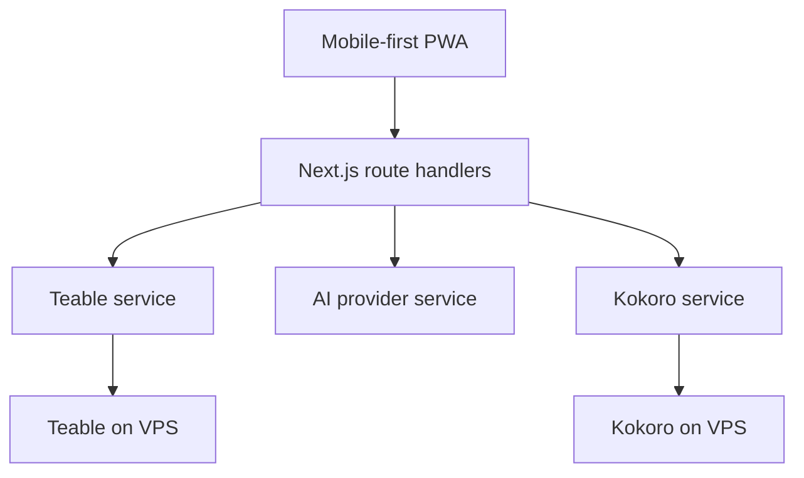

# Stack Decisions

## Decision

Build AI Fluency as a **Next.js + TypeScript mobile-first PWA**.

## Why This Stack

The app needs a polished mobile UI, secure server-side API calls, PWA installation, and a simple path to deploy. Next.js gives us:

- React components for the mobile UI.
- App Router for screen organization.
- Route handlers for protected server-side integrations.
- Environment variables for credentials.
- A straightforward path to PWA support.

## App Architecture

## Frontend

- Next.js App Router.
- React components.
- TypeScript.
- Mobile-first CSS.
- Bottom navigation as a shared component.
- App shell with safe-area support.

## Backend Internal API

All external integrations must go through internal server routes.

Server-side services:

- `TeableService`: reads/writes app data.
- `AIService`: generates conversation, corrections, summaries, and suggestions.
- `KokoroService`: generates voice audio.
- `LearningAnalysisService`: normalizes AI output into app records.
- `RecommendationService`: suggests topics based on feedback and words.

## Security Rules

- No Teable API key in frontend code.
- No Kokoro API key in frontend code.
- No AI provider key in frontend code.
- `.env.local` must not be committed.
- Client receives only connection status, masked key labels, and generated content.

## PWA Requirements

- `manifest.webmanifest`.
- App icons.
- Theme color matching the green brand accent.
- Installability on mobile.
- Offline fallback for shell/loading states.
- Online requirement for new conversations and sync.

## Deferred Decisions

### Speech-to-text

Kokoro handles TTS. User voice transcription still needs a provider decision. MVP can ship with text input plus Kokoro-generated AI audio.

### Authentication

For the first build, choose between:

- Personal single-user app.
- Multi-user app with login.

Single-user is faster and fits the current personal-app brief.

### Audio Storage

Kokoro audio uses a persistent private file cache on the app VPS.

- Cache key: normalized text, voice, and output format.
- Storage: `AUDIO_CACHE_DIR` on a persistent mounted volume.
- Retention: bounded by `AUDIO_CACHE_MAX_MB` and `AUDIO_CACHE_MAX_AGE_DAYS`.
- Delivery: private internal route `/api/voice/:audioId`, never a public storage directory.
